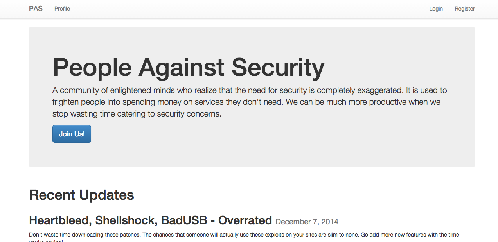
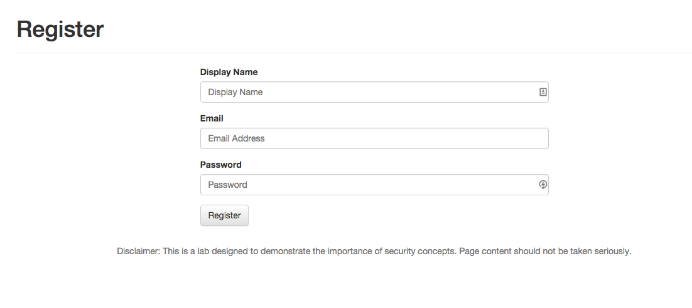
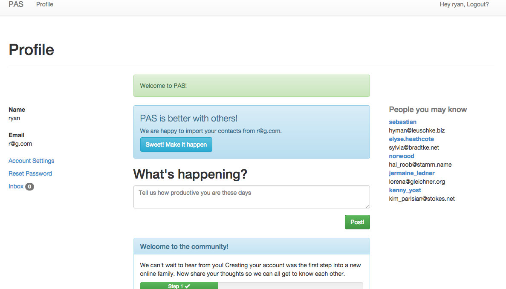
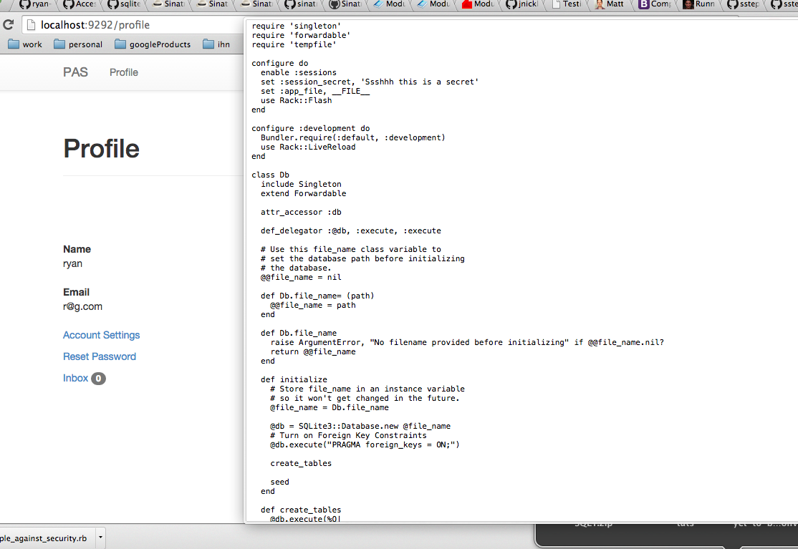
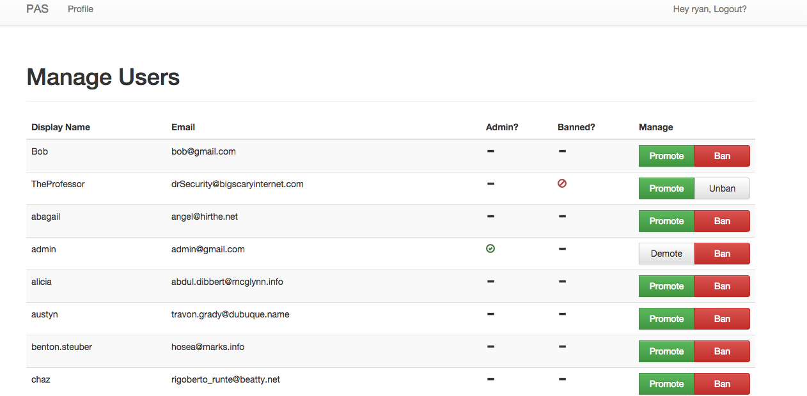
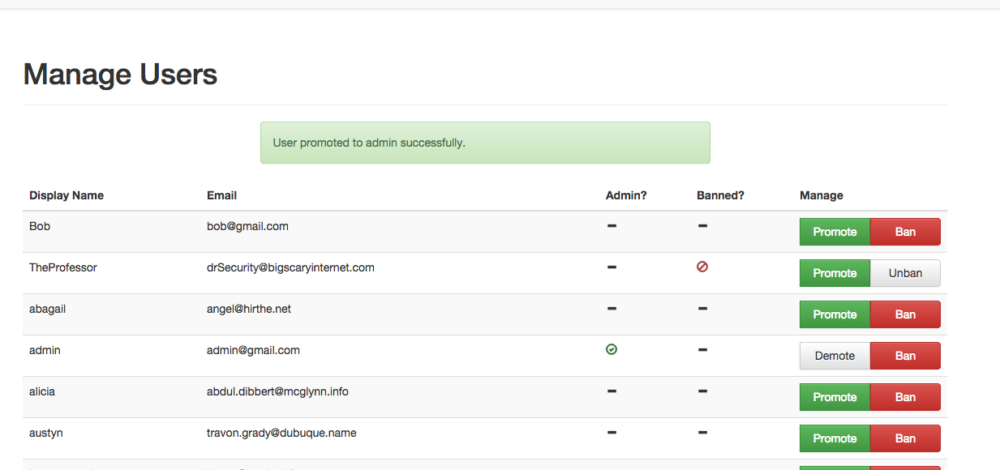
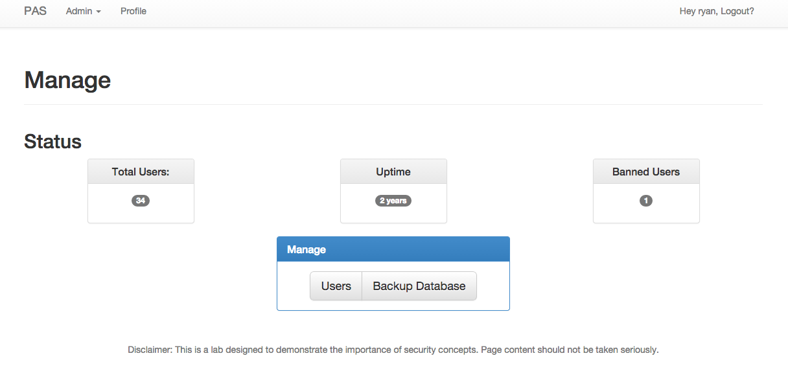
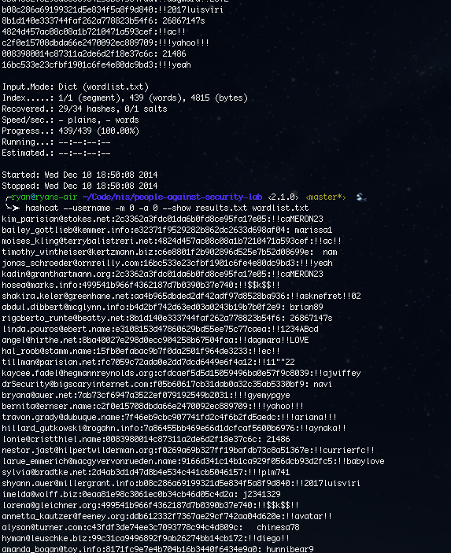

# Website Penetration Testing Lab

Ryan Robeson

## Objective
Gain an understanding of all multiple small exploits can lead to huge problems for web developers.

## Results
Got site running

Registering

Viewing Profile

Found Source

Manage Users

Escalated Privileges

Found Database

Cracked Passwords

